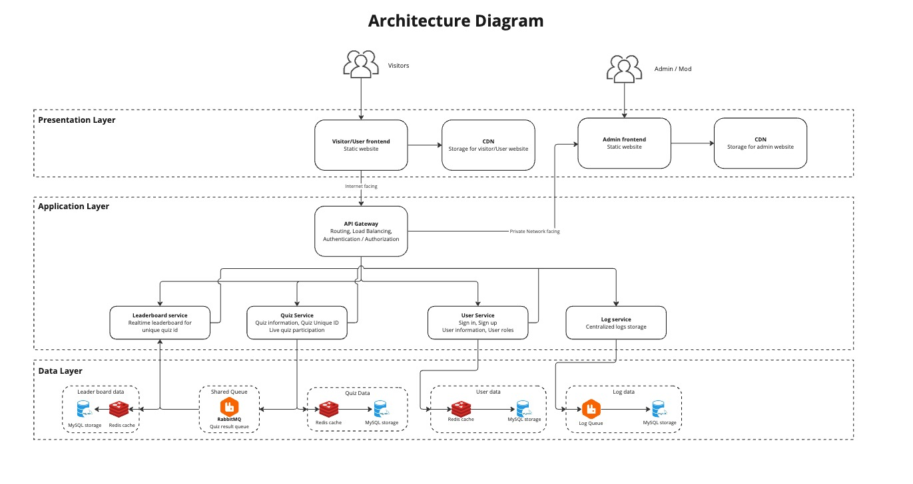
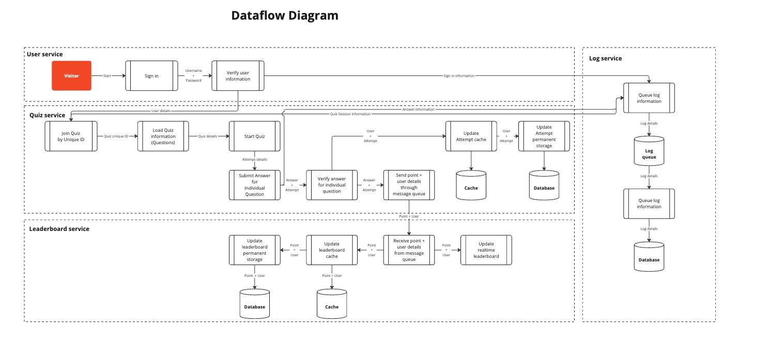

# Real-Time Vocabulary Quiz Coding Challenge

## Overview
Technical solution for a real-time quiz feature for an English learning application. This feature will allow users to answer questions in real-time, compete with others, and see their scores updated live on a leaderboard.

## System design

### Architecture Diagram

### Components
1. API Gateway: Handle requests routing from visitors to other components/services within the system. Handle authentication and authorization.
2. Log service: Store all actions that are performed within the system.
3. User service: User information, credentials storage. Handle user session (sign in, sign out), user registration.
4. Quiz service: Store quiz information, questions, question's options (with correct answer and incorrect answers) information.
5. Leaderboard service: Store leader board information, receive change of points from Quiz service and announce point-change via websocket, handle realtime leaderboard.
6. Frontend components: Statically-built websites that will be served to visitors and administrators.

### Dataflow
There are 3 principles that dicate the flow of data within this system:
1. Seperation of data storage: this allows each component/service has their own data layer, thus reduce effect of another downed component. Each component can function independently. 
2. Interservice communication through message queue: allows decoupling the system.
3. Cache first: each component always priority the use of cached data, but data must always be stored within a permanent storage like an RDBMS.

### Technologies and tools
There are 5 main reasons that will dictate both the technologies and tools of choice, but also affect the whole system design:

1. Scalability: The ability to scale up and down based on the load of system, but also on the load of individual component/service.
2. Performance: Each component should perform well under heavy load and ensure high performance of the system.
3. Reliability: Each component should be reliable and handle errors, logs gracefully. Ideally, each component should not affect other components.
4. Maintainability: Code should be clean, well-organized and easy to maintain.
5. Monitoring & Observability: Dataflow of each component should be able traced back to the point of modification, creation of each data type.

#### Development pipeline
+ Github: acts as source of code storage, code changes and the ability to work collaborately. Alternative choice: Gitlab, Bitbucket.
+ Github issues and Github project: offers a central way to plan, manage issues. Alternative choice: Jira.
+ Github CI/CD: automation of tests & deployments. Alternative choice: Jenkins, CircleCI.
+ SonarQube: code coverage & continuous inspection of code to perform automatic reviews of code quality, code smell, code repeat, code invulnerability (SAST). Alternative choice: VeraCode.

#### Backend & Infrastructure
+ Docker: containerize each component into individual image. The choice of Docker containerization allows the avoidance of Cloud Vendor Lock-In. The system can be deployed on any cloud provider, both public and private (preferrably through K8s). Docker also offers the ability to quickly scale up and down.
+ Redis: Redis offers in-memory key-value caching, offers low-latency data accessing, while maintaining the ability to scale. Alternative choice: memcached.
+ MySQL: MySQL is a matured, stable and ACID-compliant RDBMS. MySQL also offers the ability to scale. Alternative choice: MariaDB, PostgreSQL.
+ dotnet framework (formerly .net core framework) with C#: dotnet offers a matured & stable framework for building web application. Dotnet with ASP.NET offers a wide range of libraries & packages which are under active development. Nuget (package manager) offers an overall view of each package, with dependency, compatibility, documentations, etc. ASP.NET also offers excellence real-time capability with SignalR (based on websocket).

#### Frontend
+ NextJS: NextJS is a matured & stable ReactJS framework, with the ability to configure React like bundling, compiling, routing, Typescript, API integration, data binding, etc. NextJS allow developers to configure only once for focus into developing features. Alternative choice: Vite.
+ Tailwind: Tailwind offers the ability to rapidly prototype and build website with minimal dependency and bundle size.
+ CDN: CDN (Content Delievery Network) allows fast access to our frontend website with the use of globally connected servers. This ensures low latency, near-zero downtime, versioned deployment through CI/CD.